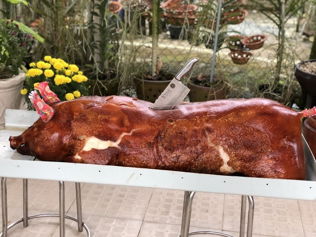
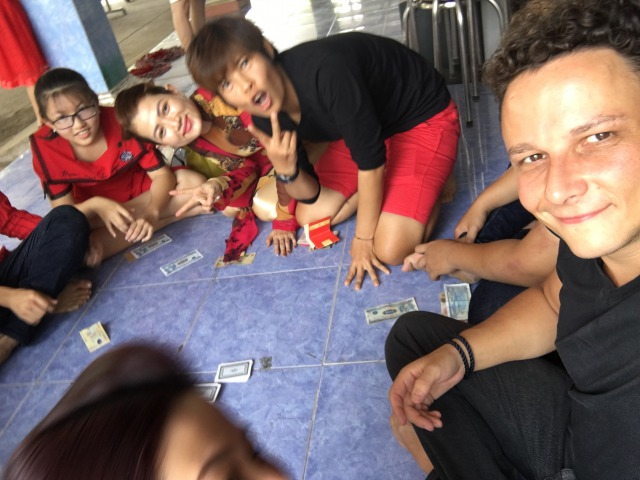
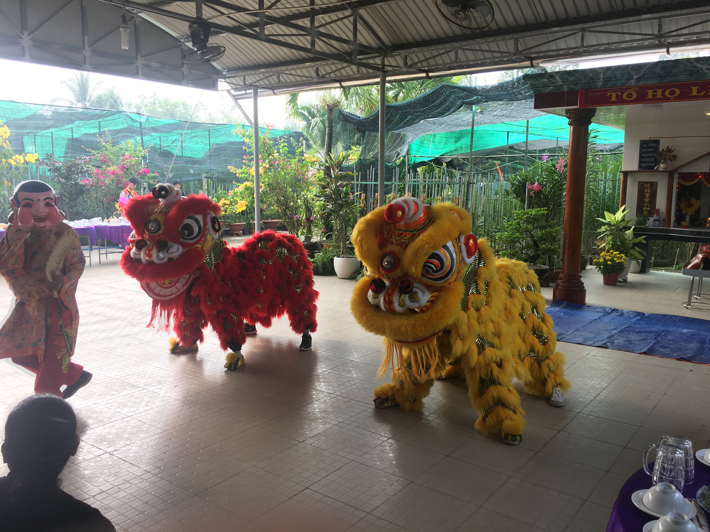
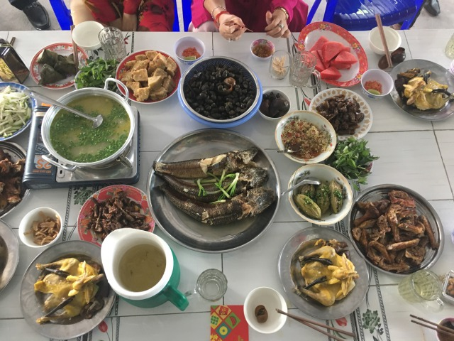
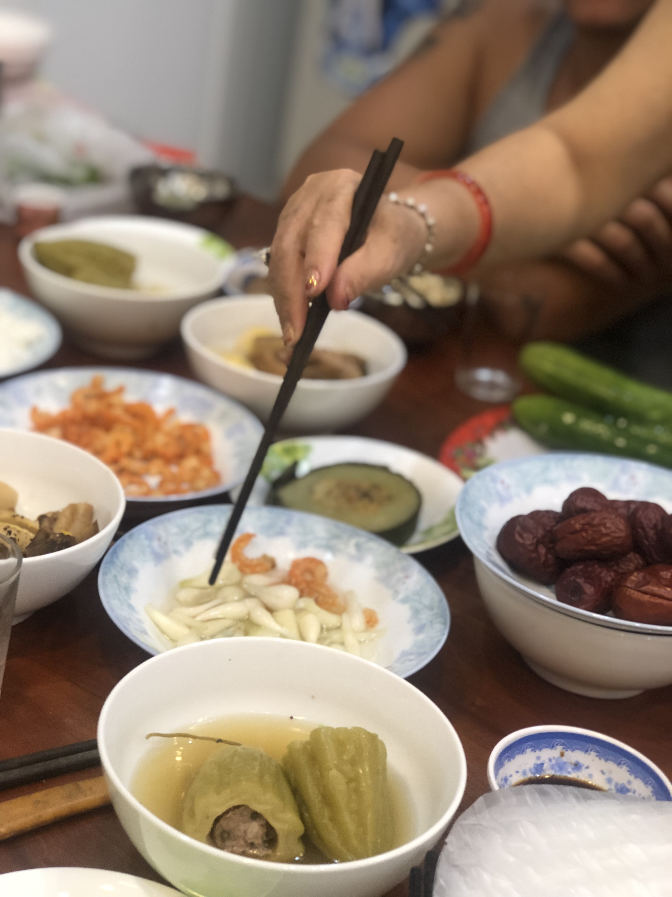
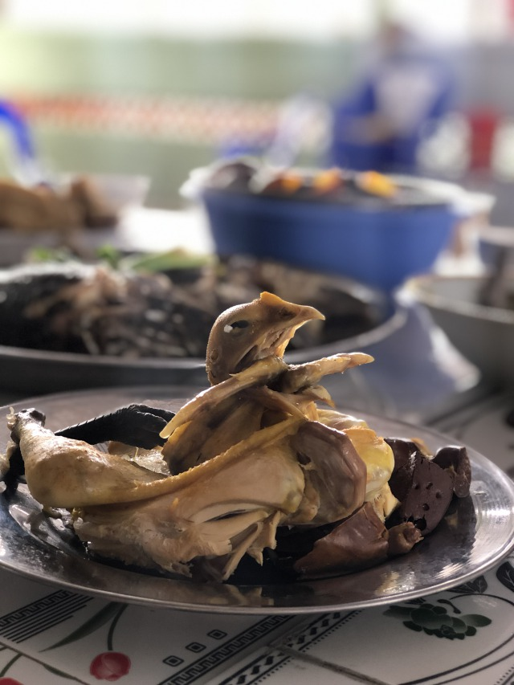

Dem Mondkalender folgend fällt der Jahreswechsel in vielen asiatischen Ländern auf den Zeitraum Ende Januar/Anfang Februar. 

Im Wechsel werden die 12 Tierkreiszeichen des chinesischen Kalenders durchlaufen. 2019 liegt im Zeichen des Schweins, was dem Titelbild einen makaberen Beigeschmack verleiht. 

_Willkommen im Jahr des Schweins mein Freund_

Innerhalb der Mondkalender treuen Länder ist das Neujahrsfest unterschiedlich benamt. In Vietnam ist es unter dem Namen „Tet“ bekannt und steht für nicht weniger, als 7 Tage Ausnahmezustand. 

Saigon erinnert im Ansatz an den postapokalyptischen Science-Fiction Thriller „I am Legend“, die Landstraßen sind gepackt mit Fahrzeugen, die sich dicht an dicht reihen, um von ihren Insassen gen Heimatdorf gelenkt zu werden. 

Wer es bis dorthin geschafft hat verbringt die Feiertage gemeinsam mit Familie, Freunden, viel Essen und Alkohol und jeder Menge Karaoke. 

Ich hatte das große Glück gemeinsam mit einem Freund die Tet Woche bei einer vietnamesischen Familie außerhalb Saigons verbringen zu dürfen. 

Der erste Tag des Neujahrsfestes ist hierbei der Familie gewidmet, der dritte Tag gilt den Lehrern  (klingt komisch, ist aber so), Tag zwei und vier werden inoffiziell genutzt, um mit Freunden zu feiern. 

Innerhalb welcher sozialen Gruppierung man sich befindet spielt für den Ablauf letztlich keine Rolle. 
„Brot und Spiele“ bespassen auch im fernen Osten die Massen. Wobei man in Vietnam wohl eher von „Fleisch und Karaoke“ sprechen sollte. 

Das wichtigste Ritual während Tet ist mit Sicherheit die Verteilung des „Lucky Moneys". Geld, dass von den älteren Generationen an die jüngeren weitergegeben wird und Glück für das kommende Jahr bringen soll. 
Die verschenkten Geldbeträge können dabei stark variieren. Der Brauch will es, dass die beschenkten sich nach Erhalt des Geldes zum gemeinsamen Zocken zusammenfinden, wo die Börse mit etwas Glück direkt noch weiter aufgestockt werden kann. 

_Erst kassieren, dann zocken. Beim Black Jack kann jeder versuchen seine Börse noch weiter aufzubessern_

_Drachentanz am vierten Tag des Neujahrsfestes_

Das Tet Fest ist nicht nur eine aufregenden Gelegenheit verschiedene Bräuche und Traditionen zu erleben. Vor allem bietet es die Chance der regionalen Küche fernab jedes westlichen Einflusses gründlich auf den Zahn zu fühlen. 

Die gewonnenen Erkenntnisse variieren von herausragend bis abscheulich. 

Wer einen schwachen Magen hat lässt selbigen gerne zuhause. 

Klassisch beginnt der Morgen gegen 07:00 Uhr mit inbrünstigen Weckrufen aus den Karaokemaschinen nahegelegener Mitbürger. Auch wenn der Inhalt vermutlich fröhlicher und weniger menschenverachtend ist erinnert diese Form des liebevollen wachgeschrien werdens allzu sehr an die Nord Koreanische Propagandamusik, die täglich das gesamte Land mit Lobesgesängen auf den Führer aus den Betten brüllt. 

Die Tage über Tet beginnen mit einem gemeinsamem Frühstück wechselnder Protagonisten. Bereits ab 08:00 versammeln sich um den Esstisch Familie, Freunde, Kollegen, oder Nachbarn die einfach Bock auf saufen haben. 

In unzähligen Schälchen verteilen sich Spezialitäten, Leckereien und für den westlichen Magen auch diverse Überraschungen. 

_Von Schleck bis Würg alles dabei_

_Nicht nachdenken - einfach zugreifen_

_Frühstücksvogel _

Schnell lerne ich, dass die Vietnamesen große Freunde effizienten Trinkverhaltens sind. 
Sobald jemand am Tisch zum „bottom up“ aufruft ist gesetzt, dass dem auch jeder folge leistet. Ungeachtet der verbleibenden Menge im Glas. 

Nach diversen geexten Bieren und ungewollt schnell einsetzender Rauschzustände wird schnell klar: Wer das Glas zur Gänze füllt scheidet umso schneller aus der illustren Runde aus und findet sich dehydriert bei 35 Grad unter einem schattenspendenden Baum liegend. 

Wer clever ist schafft also zeitnah nach dem Karaokeweckruf eine solide Grundlage für die folgenden Alkoholika. 

Ein gutes Stück Schweinskopfülze mit Fischsauce rundet das fermentierte Entenei erst so richtig ab. Mit einem großen Schluck aus dem Frühstücksbier werden ein paar Brocken Rindersehnen in Chilimarinade runtergespült. Wer dem Durchfall der kommenden Tage eine weitere Facette verleihen möchte nascht hier und da zwischendurch eine Chili, sofern dazu aufgefordert wird und belustigt mit der rasch einsetzenden Schnappatmung die vietnamesische Runde, innerhalb derer die Schoten wie Salzbrezeln gereicht und verzehrt werden. 

Sich dem Einschenkverhalten anpassend sollte man also auch bei der Wahl fester Nahrungsmittel nicht übermütig werden und sich zunächst mit kleinen Portionen vorsichtig herantasten. 
Mut wird am Vietnamesischen Esstisch belohnt! Entweder mit einer guten Geschichte oder mit einem guten Essen. Manchmal auch mit beidem. Abseits all der für westliche Mägen gewöhnungsbedürftigen Spezialitäten haben sich auf jedem Tisch auch stets hervorragende Nudelgerichte, Gemüse, Kräuter und herausragende Fleisch- und Fischgerichte gefunden. 

Frisch, unkompliziert und lecker. Klassisch vietnamesisch eben. 

Über den Tag verteilt kommen und gehen Freunde und Familienangehörige. Die Frauen schaffen emsig immer weitere Schälchen und Teller aus der Küche auf den Tisch. Bier und Essen gehen niemals aus. 

Wer spät kommt oder taktisch klug trinkt und am Ende des Tages noch dazu im Stande ist ein Mikrophon zu halten kann in die tägliche Karaoke Runde einsteigen und Rache an den Nachbarn üben, deren zeitlicher Ablauf Karaoke für die Morgenstunden vorgesehen hatte. 
Irgendeiner singt letztlich immer irgendwo. 

_Gastgebertochter Chung beim vietnamesischen Volkssport_

_Wenn, dann richtig. Mit 3800 Watt durch die Nacht_

Tet ist...

Anstrengend aber liebenswürdig. 

Klassisch Vietnam eben. 

Wie immer freue ich mich über Kommentare und eure Meinung zum Thema. 
