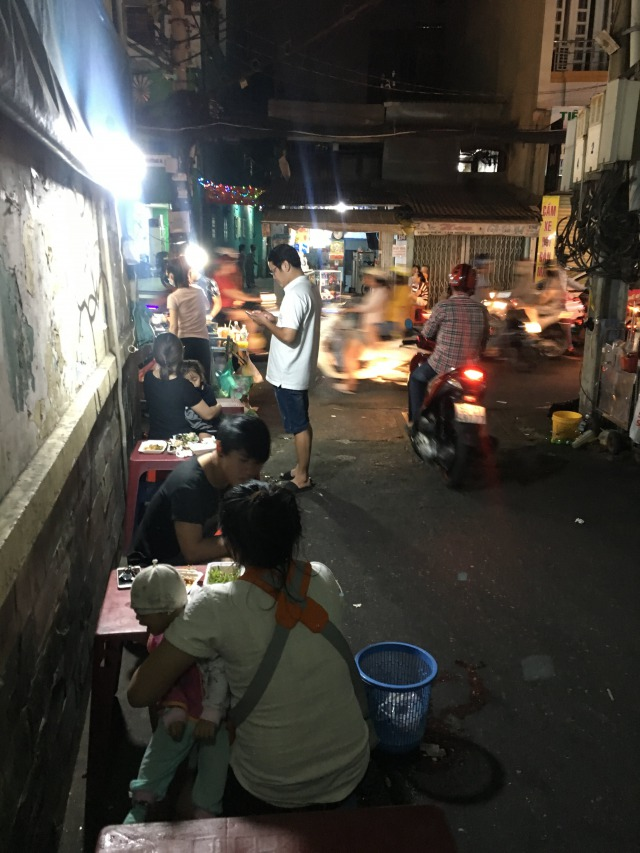
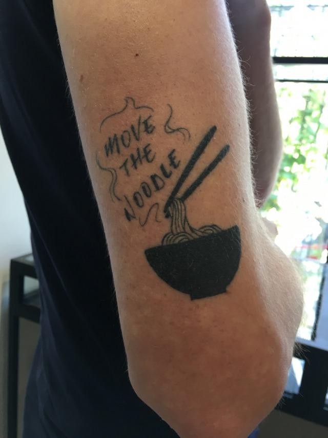

Dampfend heiß kommt sie daher. 
Gereicht wird sie mit Chili, Koriander, Limetten und anderen Köstlichkeiten, um sie weiter zu verfeinern. Verspeist wird sie in dunklen Ecken, engen Gassen oder vielbefahrenen Hauptverkehrsstraßen. Jung und Alt, Reich und Arm genießen sie gleichermaßen auf lächerlich fragil wirkenden Kinderstühlen, die den Anschein erwecken kaum mehr, als ihr Eigengewicht tragen zu können. 

_Auf den ersten Blick abschreckend, auf den ersten Biss ansteckend -Klassische Streetfood Szenerie-_

Mit jedem Tag und jedem Koch erfindet sie sich neu und überrascht mit stets wechselnden Zutaten, so wie unerwarteten Köstlichkeiten, die sich offenbaren sobald sich der Nebel aus Dampf und Kräuterdüften, mit dem sie sich umgibt lüftet, um ihren ganzen Charme zu offenbaren. 

Die Pho Suppe. 

Nationalgericht, Tradition, Lebensgefühl! 
Treuer Begleiter durch alle Hauptmahlzeiten, oder Snack zwischendurch. Vor allem aber Lebensretter zu später Stunde, wenn alkoholgetriebene Gelüste den geschundenen Körper in Zentraleuropa zum Koma-Döner rufen würden.

_Mut zur Suppe!_

Die Pho variiert von Nord nach Süd, von Provinz zu Provinz und von Familie zu Familie. Egal wo und wann sie gereicht wird vermag sie es jedoch stets abzuliefern! 

Hier meine **5** Gründe, warum die Pho der Mercedes unter den Straßengerichten ist: 

**1 Die Pho ist frisch**

Die Pho wird täglich frisch gekocht. Gammelfleisch und industriell verarbeitete Zusätze kennt sie nicht. 

**2 Die Pho ist lecker**

Ob Pho Bo mit Rindfleisch, oder Pho Ga mit Hühnerfleisch, nie fehlt es ihr an Charakter und geschmacklichen Nuancen, die von frisch bis deftig reichen. 

**3 Die Pho ist günstig**

Ab 80 Cent geht der Suppenspass los. Wer ein lockeres Portemonnaie hat haut schon auch mal 2€ für eine Suppe raus. 

**4 Die Pho ist des Trinkers bester Freund**

Während der rausgesoffene Zentraleuropäer auf dem Nachhauseweg die hälfte seiner orientalischen Fleischtasche auf sich und seiner Kleidung verteilt, schlürft der Asienreisende seine Suppe gemütlich auf Kinderstühlen, von denen man im Ernstfall beruhigend niedrig fällt. 
Er versorgt seinen Körper mit ausreichend Flüssigkeit und Mineralien und genießt zarte Fleischeinlagen, so wie leckere Reisnudeln. 
Eine Prä-Katermahlzeit in Suppenform. 

-Nein! DIE Prä-Katermahlzeit-

**5 Die Pho ist der Meister Proper unter den Straßengerichten**

Die Faustregel für Streetfood besagt: „Cook it, peel it or leave it“ (zu deutsch: Kochen, schälen oder liegen lassen). 
Jede Suppe wird dampfend heiß und daher keimfrei gereicht. 
Ein Begleiter, auf den stets Verlass ist. -

Anthony Bourdain beschrieb es einst wie folgt: 

„Etwas unbekanntes in einer Schüssel, ein kaltes Bier, ein winziger Plastikstuhl mitten auf der Straße 

Das ist der Pfad zu wahrem Glück und Weisheit"

Recht hatte er, der Anthony. 

Dank dir Pho Suppe! Du hast mir all das gegeben, was Streetfood mit je versprochen hatte. 

Wie immer freue ich mich über Kommentare und eure Meinung zum Thema. 
