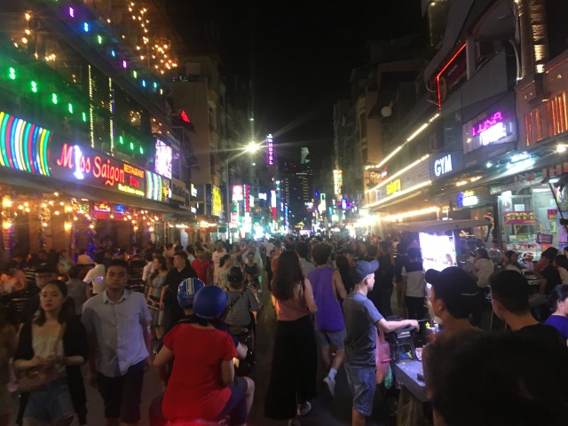
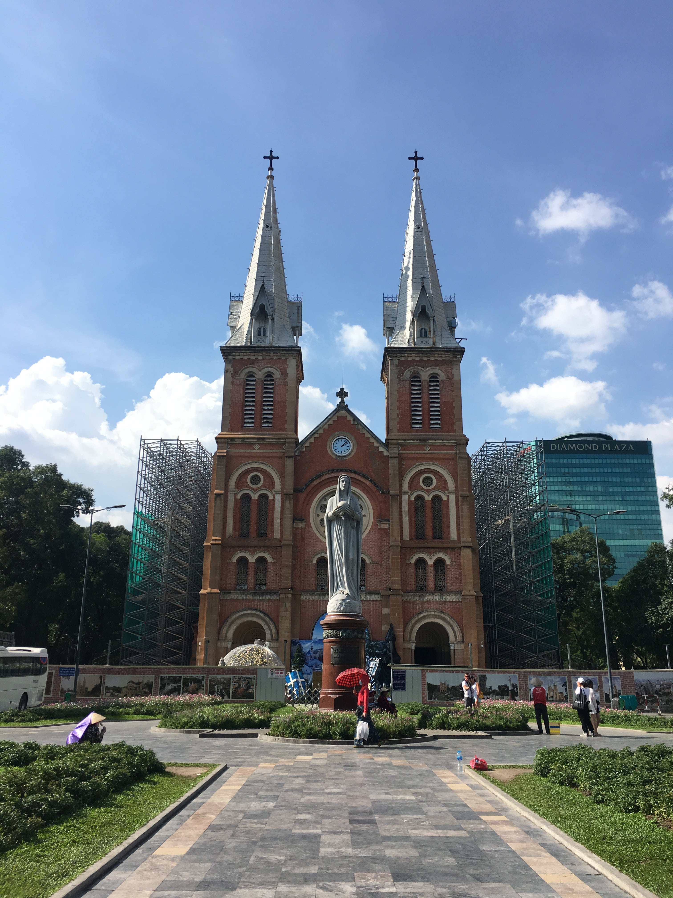
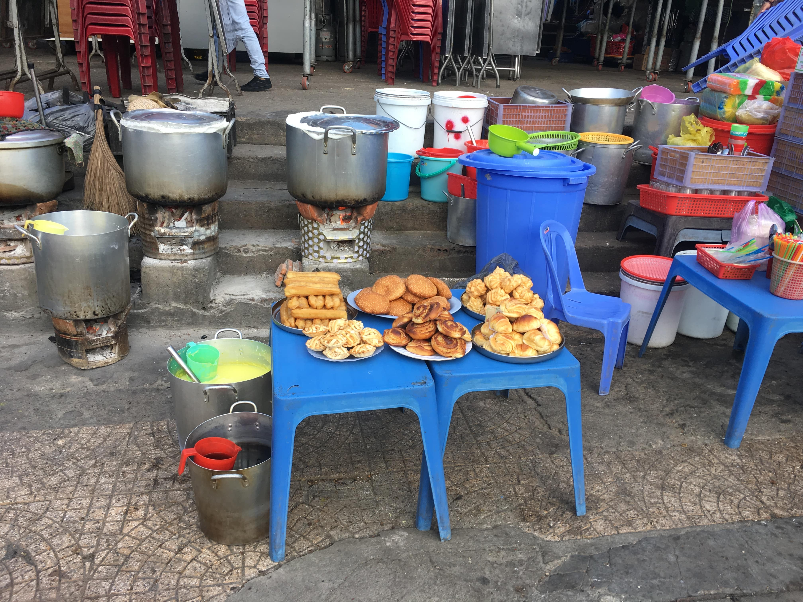
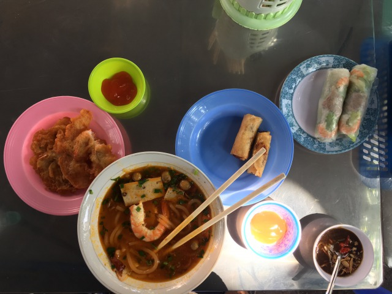
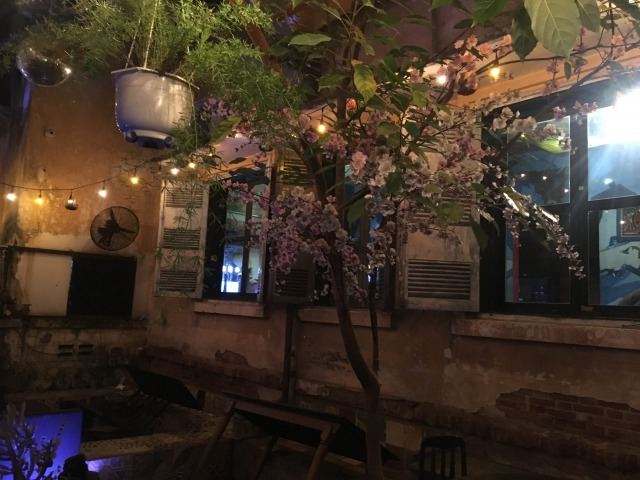
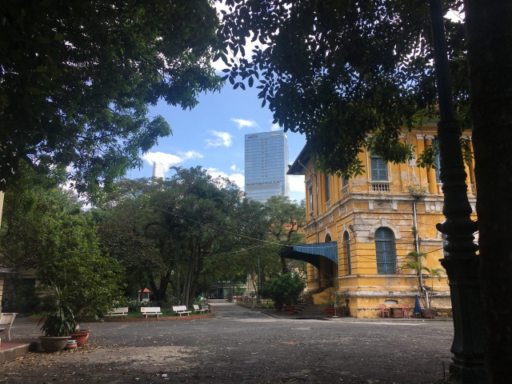

Wenn Sido in „Mein Block" sein Berlin beschreibt und von „hohen Häußern, dicker Luft und ein paar Bäumen" spricht kann man schnell Parallelen zwischen den beiden Städten finden. Was aus der Ferne abschreckend wirken mag, verwandelt sich jedoch wie in Sidos Hitsingle schnell in ein wahres Füllhorn an Möglichkeiten und Chancen, sofern man der Stadt die Chance gewährt auf den zweiten Blick zu gefallen.  

Saigon kann man lieben oder hassen, innerhalb von Minuten in den Bann der Stadt gezogen werden oder nie begreifen, warum es Menschen aus aller Welt hier hin verschlägt. 

Ho Chi Minh City ist nicht nur die inoffizielle Hauptstadt Vietnams, sie ist auch offizielle Hauptstadt der Rollerfahrer. 

Sie ist laut, dreckig, chaotisch und unübersichtlich. Sie ist vielfältig, liebenswürdig, spannend und voller Schätze, die es zu entdecken gilt. 

Saigon ist was Du draus machst! 

Eine Stadt, die zu reichhaltig ist, um sie simplifiziert zu beschreiben. 
In insgesamt 12 durchnummerierte und 12 benamte Stadtbezirke teilt sie sich auf, ist Heimat für über zehn Millionen Menschen, erfindet sich in jedem Bezirk neu und findet immer wieder Wege zu begeistern und zu überraschen. 

Der geneigte Expat oder Reisende landet nicht von ungefähr sehr Zentral. Der klassische Einstieg führt die Meisten über die Gegend um die Buy Vien Walking Street, wo EDM aus Boxentürmen feierwütige Touristen zu Hörsturz, regionalen Bieren, Cocktails und Happy Balloons einlädt. 

_Buy Vien Walking Street
_

Dieses Sodom und Gomorra erinnert schon auf den ersten Metern deutlich an die berüchtigte Khaosan Road in Bangkok und ist ebenso absolute Geschmacksache. 

Wer dem Tumult entkommen möchte findet im ersten Stadtbezirk jedoch auch allerhand internationaler Bars, Restaurants, Märkte und unzählige Freizeitangebote. 

_Das Wahrzeichen Saigons im Distrikt 1 die berühmte Notre Dame Kathedrale_

Innerhalb der verschiedenen Stadtbezirke finden sich nicht nur große Gemeinden an westlichen Expats, die sich v.a. im 2. Distrikt tummeln und sich dort regelmäßig über geflutete Straßen freuen, in Saigon findet sich mit 90.000 Einwanderern auch die größte koreanische Gemeinde außerhalb Koreas, die sich überwiegend auf das siebte Distrikt verteilt. Ebenso findet sich eine große japanische Gemeinde im zentralen Distrkt 1. Das obligatorische China Town darf natürlich ebenso wenig fehlen und findet sich in Cholon, Distrikt 5. 

Egal wo du dich in Saigon befindest, die nächste Garküche ist nie weit und lädt auf Kinder-Plastikstühlen stets zu Leckereien ungeklärten Ursprungs. 

_Französische Küche trifft auf Asiatische_

_Immer einen Versuch Wert -Streetfood in Saigon- _

Wer die Stadt erkunden möchte hat im Bereich Fortbewegungsmittel letztlich nur eine ernstzunehmende Möglichkeit.
Nämlich den Roller. 
Wer mutig ist fährt selbst, allen Anderen seien Fahrdienste, wie „Grab" oder „Go Viet" ans Herz gelegt. 

Trotz des permanent hohen Verkehrsaufkommens findet man sich in überwiegend flüssig ablaufenden Szenarien wieder, sofern man gewisse Straßenabschnitte zu den üblichen Stoßzeiten vermeidet. 

Schweißtreibender, aber dank kaum vorhandener Fußgängerrechte nicht weniger Abenteuerlich ist der Ausflug zu Fuß. Wer sich auf den eigenen Beinen aufmacht die Stadt zu erkunden wird dafür aber umso häufiger belohnt. 

Die gemütlichsten Cafés und schönsten Plätze zum Verweilen finden sich gerne in den kleinsten Winkeln und verstecktesten Ecken. Nicht selten muss zunächst ein Restaurant oder ein Café in Gänze durchquert werden, um zu einem weiteren Lokal z.B. im Hinterhof zu gelangen. Wer in Ho Chi Minh nur an der Oberfläche kratzt verpasst das Beste. 

_Nur wer weiß wo, der weiß wo -Innenhof des Indika in Distrikt 1-_

Saigon ist eine grüne Stadt. 
Unzählige Parks, die sich über die ganze Stadt verteilen laden ein, dem hektischen Verkehrstreiben zu entkommen, sich sportlich zu ertüchtigen oder einfach die Seele baumeln zu lassen. 
Neben gemütlichen Parkanlagen, die stets mit Cafés und „Trimm dich" Geräten gespickt sind finden sich v.a. im Stadtkern muckelige Alleen mit französischen Bauten im Kolonialstil, deren Erscheinungsbilder von perfekt erhalten bis charmant verfallen reichen und dem Stadtbild so noch eine weitere Facette verleihen. 

_Stadt der Gegensätze -Glitzerfassade im Hintergrund, französischer Baustil im Vordergrund-_

Saigon ist vieles. 

Nur nicht langweilig. 

Wer sich von überwältigendem Chaos, _dicker Luft und hohen Häusern_ nicht abschrecken lässt und bereit ist ein Teil davon zu werden kann sich sicher sein dafür reich belohnt zu werden. 

Wer diese Stadt bereits mag wird Sie dank Ihrer Bewohner lieben. Auch im westlich geprägten Ho Chi Minh steht die Gastfreundschaft und liebenswürdige Art der Vietnamesen derer in anderen Landesteilen in nichts nach. 

Wie immer freue ich mich über Kommentare und eure Meinung zum Thema. 
