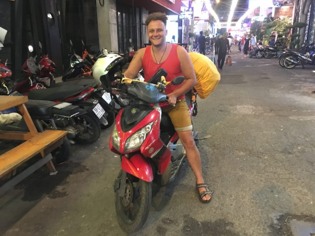

Geboren und aufgewachsen in ländlichen Gefilden des schönen Schwabenlandes hat es mich nach Beendigung meiner Ausbildung zum Studium ins Rheinland geführt. 

Die Große Kreisstadt Öhringen, die trotz der Namensgebung auch auf den zweiten Blick nicht besonders groß ist wich der Grenzstadt Aachen. 

Aus Schwabilon wurde Oche und meine Welt um ein vielfaches größer. 

Die erste Vermutung keimte auf, dass es nicht nur dahom schön ist. 

Da der Nutzen meiner Anwesenheit bei Vorlesungen sowohl für die Veranstaltung als solche, wie auch für mich eher marginal schien ward ich innerhalb der Schulgebäude wenig gesehen. Die gewonnene Zeit habe ich allzu gerne genutzt, um die Metropolregion Rheinland oder umliegende Länder zu erkunden. 

Über ein Auslandssemester verschlug es mich in 2015 nach Süd Korea. Raus aus der Komfortzone und rein ins Abenteuer. Eine Zeit, die mich geprägt hat wie keine Andere zuvor. 
Ein Erlebnis, das für mich durch nichts zu ersetzen ist und Rückblickend ein wahrer Augenöffner war. 

_Seoul Baby_

Mein Hunger auf neue Horizonte wurde größer und so auch mein Vertrauen darin meine nächste Reise selbst in die Hand zu nehmen und mich ausserhalb eines festgelegten Universitätsalltags an Asien zu versuchen. 

In 2016 habe ich mein Studium beendet, die letzten finanziellen Krümel zusammengekratzt, den Rucksack geschultert und mich auf eine zwei monatige Reise ins Ungewisse begeben. 

Mein Weg hat mich über Thailand nach Myanmar und Laos geführt. 
Eine wunderbare Reise, voller einzigartiger Erlebnisse und wertvoller Bekanntschaften. 

Im Aussteigerparadies Pai (Thailand) durfte ich mit Amanda und Shawn eine der prägendsten Bekanntschaften schließen. Ein liebenswürdig schrulliges Paar aus Amerika. Ausgezogen, um in Thailand zu unterrichten. 

Über Joint und Bier haben die Beiden mir das Lebenskonzept „Englischlehrer in Asien“ vorgestellt und mir aus ihrem Leben berichtet. 

Skepsis wich binnen kürzester Zeit purer Faszination und mein Gesichtsausdruck glich über die kommenden Gesprächsstunden vermutlich dem eines 12 jährigen, der gerade das Onanieren für sich entdeckt hat. 

_Amanda, Shawn und ich in Chiang Mai_

Das neue Lebensziel war klar. Asien! One Way! 

Nach fünf Jahren Studium war mein Bankkonto leider nicht d´accord mit diesem Plan und so habe ich die kommenden zwei Jahre genutzt, mich auf diesen großen Sprung vorzubereiten. Schulden abbezahlen, Startkapital ansparen, Lehrzertifikat erwerben und am 18.10.2018 hies es dann final:

ABFATZEN 

Dieses mal sollte mein Weg mich nach Vietnam führen. Auf meinem tapferen Roller „Willi“ bin ich von Hanoi bis Saigon gefahren, um hier meine Zelte aufzuschlagen und wenn du dich dafür interessierst, was ich bisher so erlebt habe, dann bist du hier goldrichtig. 

_Dreckig aber glücklich: Nach 2000 Kilometern Ankunft in Saigon._

Wer objektive Reiseberichte und -ratgeber sucht darf diese gerne auf einer Vielzahl wunderbarer Travelblogs finden. Bei mir bist du an der richtigen Adresse, wenn du unterhaltsame Artikel zu alltäglichen Dingen des Reise- und Expatalltags suchst.

Ich freue mich jederzeit über Kommentare, Anregungen und Feedback! 

Viel Spass beim Lesen 

Euer Phil
