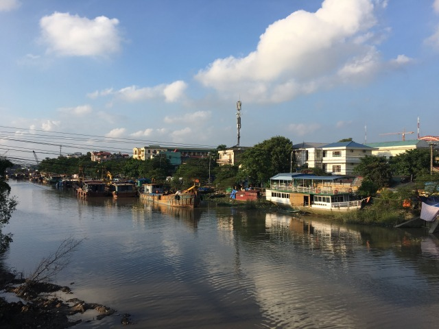
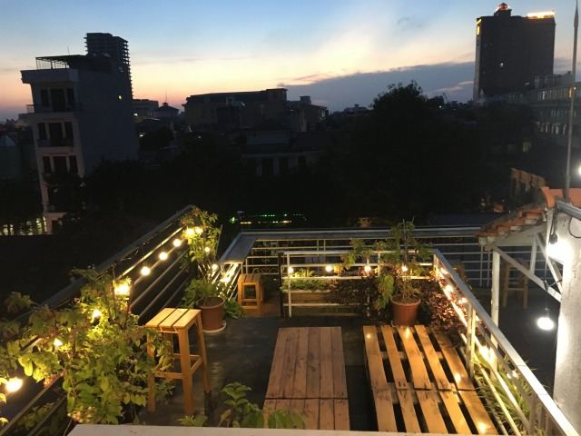
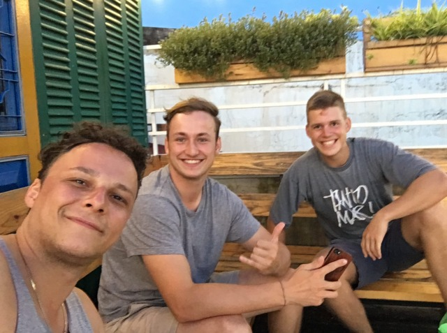

Erste Tagesetappe von Hanoi nach Hai Phong 

Obwohl mir in meinem Hanoier Hostel dringend davon abgeraten wurde nach Hai Phong zu fahren da es dort weder für Einheimische, noch für Touristen viel zu erleben gibt, wollte ich der drittgrößten Stadt Vietnams doch eine Chance geben. 

Am siebten Tag meiner Reise beschließe ich zur Mittagsstunde meine erste Tour auf der Wanderhure zu bestreiten. Für die 119 Kilometer schlägt google maps eine Fahrtdauer von knappen zwei Stunden vor. Ich halte eineinhalb Stunden für angemessener. 

Sowohl die gewählte Abfahrtszeit, als auch die von mir angestrebte Fahrtdauer haben sich rückwirkend als eher umnachtete Gedankengänge herausgestellt.

Gefühlte fünf und gemessene zwei Stunden quäle ich mich bei brütender Hitze durch mehr stockenden, als fließenden Verkehr und kämpfe mich so Stück für Stück aus der Hauptstadt. 

Die Ausläufe Hanois sind in ihrer optischen Erscheinung eher zweckmäßig, als den Augen schmeichelnd. 
Auf den maroden und verdreckten Straßen schlängele ich mir meinen Weg durch unendliche Blechlawinen aus ebenso verdreckten und maroden Lastkraftwagen, Rollern und vereinzelten PKW. 

Nach den von google vorgeschlagenen zwei Stunden Gesamtfahrtdauer habe ich lediglich 50 Kilometer hinter mich gebracht.

Die restliche Etappe führt mich durch unscheinbare und nicht gerade attraktive Dörfer, nach knappen vier Stunden Fahrtdauer erreiche ich Hai Phong.

Als ich vom Roller absteige, um auf meinem Handy nach geeigneten Unterkünften zu suchen vibriert mein ganzer Körper. Mein Gesicht ist Rußschwarz und meine Nase zum ersten mal verbrannt. Leider werden zwei weitere mittelschwere Verbrennungen der Nase folgen. 

Ich lasse mich zum bestbewerteten Hostel in meiner Nähe lotsen und bin froh meine erste Tagesetappe bewältigt zu haben. 

Wenn ich an die restlichen mir bevorstehenden 1900 Kilometer denke überkommt mich der Gedanke die Busfahrkartenoption nocheinmal zu durchdenken. 

Dennoch verspüre ich auch ein Gefühl von Stolz und buche meinem Maskulinitätskonto einen Fleißpunkt für männliche Tagesaktivitäten hinzu. 

Das Entladen meines Rollers gestaltet sich zeitlich angenehmer, als das Beladen, ich checke in mein Hostel ein, wasche mir Dreck und Straßenstaub aus dem Gesicht und schlumpfe los gen Stadtkern.

Ich erkunde Hai Phong zu Fuß und entdecke eine durchaus schöne und gemütliche Stadt, die mit ruhigem Verkehr und günstigen Preisen zu überzeugen weiß. Von der Hektik Hanois ist für mich wenig zu spüren, was ich bereits nach wenigen Tagen im chaotischen und hektischen Vietnam durchaus für mich zu schätzen weiß. 

_Von Metropole wenig zu spüren: Auch auf den zweiten Blick ist Hai Phong fern von vietnamesischem Großstadtwahnsinn_

Ich genieße auf dem lokalen Markt im Stadtzentrum einen Eiscafe und etwas Streetfood und die Vermutung kommt auf, dass ich mit eben diesem Markt bereits das Meiste gesehen habe. 

Zurück im Hostel beschließe ich mich etwas auf die Dachterrasse zu muckeln und einen Plan für die kommenden Tage zu schmieden. 

_Wird nie Langweilig: Gaffen von der Dachterrasse _

Ich teile mir die Dachterrasse mit zwei Münchner Buam namens Paul und Fabian und über Bier und Reisrollen mit Bananenfüllung kommen wir ins Gespräch. Wie es der Zufall will sind die beiden ebenfalls unterwegs gen Süden und machen (wie die meisten) nach einer Halong Bay Tour in Hai Phong einen Zwischenstopp, um am nächsten Tag nach Ninh Binh zu reisen. 

Wir haben einen lustigen Abend mit diversen Abendessen und noch diverseren Bieren und beschließen Ninh Binh gemeinsam zu erkunden. 

_Liebe auf den ersten Blick: Paul, Fabian und ich (v.r.n.l.) _

Am nächsten Morgen machen die Jungs sich mit dem Bus auf, während ich erneut versuche Moped und Gepäck zu vereinen. Ich stelle mich überraschenderweise kaum weniger geschickt an als beim ersten Versuch einen Tag zuvor und hoffe auf eine angenehmere Fahrtstrecke. 

Nächster Halt: Ninh Binh

[Lies hier weiter](http://abgefatzt.de/blog/ninh-binh)

**Meine persönlichen random Empfehlungen für Hai Phong **

Unterkunft: May Hostel

Sehenswürdigkeiten: Innenstadt und Hafen

Essen/Trinken: Seafood auf dem Markt „Cho Tam Bac”