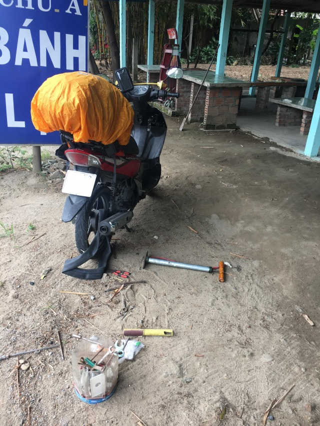
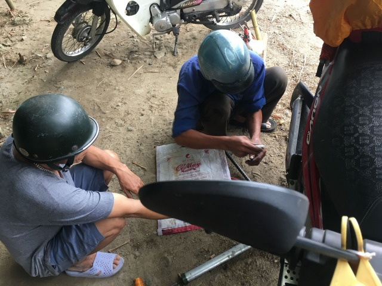
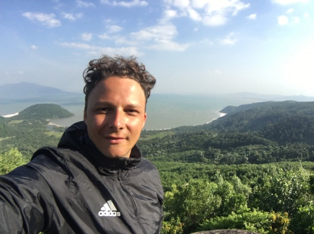

Fünfte und sechste Tagesetappe von Dong Hoi nach Hue und über den Wolkenpass nach Da Nang. 

Nach einer Nacht in Dong Hoi fahre ich weiter in die alte Kaiserstadt Hue. 

Für kulturinteressierte hat die 340.000 Seelen Stadt einige Highlights, wie z.B. die Zitadelle der verbotenen Stadt oder diverse Grabmale wichtiger, verstorbener Asiaten zu bieten. 

Die Größe Hues macht es darüber hinaus interessant die Stadt einfach zu erlaufen und sich treiben zu lassen. 

Da ich sehr selektiv kulturinteressiert bin entscheide ich mich für diese Option und spare mir „forced fun“ Aktivitäten und geheucheltes Interesse an kulturhistorischen Denkmälern. 

Mein großes Interesse gilt der Weiterfahrt nach Da Nang, da ich für die nächste Tagesetappe die Überquerung des Wolkenpasses „Hai Van“ vorgesehen habe. 

Diese Wegstrecke ist berühmt, als eine der schönsten Straßen der Welt und war zurecht Highlight des „Top Gear“ Vietnam Specials. 

Da ich mich innerhalb der Regenzeit auf Reisen begeben habe und usseliges Wetter angekündigt war entscheide ich nur eine Nacht in Hue zu bleiben, um die Fahrt über den Hai Van in vollen Zügen genießen zu können. 

Aufgrund der heftigen Anstiege und Serpentinen, die mich erwarten, verzurre ich mein Gepäck am nächsten Morgen noch nachdrücklicher, als bisher und auch dem Kinnriemen meines Helmes ringe ich eine weitere Rastung ab. 

Fest entschlossen, behelmt und verzurrt treten Ross und Reiter die sechste Tagestour an.
 
90 Kilometer trennen mich von meinem Wunschziel Da Nang. 

Ich verlasse Hue, durchquere kleine, durch Landstraßenabschnitte getrennte Dörfer und kann nach ein paar Kilometern vor mir die Berge sehen, in die der Pass geschlagen wurde. 

Ich fahre 90 Km/h beim überholen eines Lastkraftwagens, als das Ventil meines Hinterrades beschließt nicht länger mein Wegbegleiter sein zu wollen. 

Das schlagartige Entweichen sämtlicher Luft aus dem Reifen verändert das Fahrverhalten der Wanderhure derart zum Negativen, dass ich direkt nach dem Abfangen meines Mopeds den Grünstreifen aufsuche. 

Nach einer kurzen Schrecksekunde erfreue ich mich an einem nach wie vor trockenen Schlüpper und danke meinem Moped dafür, sich des Ventils vor dem Pass entledigt zu haben, wo eventuell noch vorhandene Zivilisation mir weiterhelfen kann. 

Ich halte einen vorbeifahrenden Passanten an, der nach wie vor zwei intakte Schlauchventile sein Eigen zu nennen scheint und versuche mich mit Händen, Füßen und natürlich Google Translate mitzuteilen. 

Kein Problem sagt er. 
Er kennt einen, der einen kennt, der Schläuche für Rollerreifen vertreibt, den würde er eben aufsuchen. Seine eigene Werkzeugkiste umfasse nicht nur einen 8er und einen 14er Gabelschlüssel, sondern auch einen rostigen, verbogenen Nagel, ein abgebrochenes Messer und ein Stück Schnur...Damit könne er mir den Schlauch schon wieder in meinen Reifen flönzen. 

_Hat schon bessere Zeiten gesehen: Innen- und Außenleben des Reifens unschön entzweit_

Ich drücke dem südostasiatischen MacGyver 150.000 VND (umgerechnet 6 Euro) in die Hand, er schwingt sich auf seinen Roller und ich harre der Dinge die da kommen mögen. 

Nach 20 Minuten ist der nette Herr gemeinsam mit dem Reifenverkaufsmann und neuem Schlauch zurück. Emsig machen sich beide ans Werk, mein rote Rennsemmel zu verarzten. 

Die Hälfte des oben erwähnten Werkzeugs wird nichteimal benötigt. Not macht tatsächlich erfinderisch und nach kurzer Zeit ist mein Fahrzeug wieder voll fahrtauglich. 

_Starkes Duo: MacGyver und Reifenverkaufsmann beim Zusammenführen von Schlauch und Reifen_

Wie alt ich denn sei möchte MacGyver wissen, der währen des gesamten Reparaturprozederes Sicherheitshalber seinen Armeehelm aufbehalten hatte. 

„30 Jahre, Herr MacGyver Sir“

Ob ich denn auch verheiratet sei? 

„Sir, nein Sir“

Das wäre auch kein Problem meinte er, nicht nur mit Reifenschläuchen könnte er behilflich sein, er habe auch eine astreine Tochter (oder Nichte...Google Translate war sich da nicht so sicher), die sei auch nicht verheiratet, also warum nicht einfach zwei Fliegen mit einer Klatsche schlagen. 

Im Nu hatte er eine Telefonnummer in den Sand geschrieben und ich selbige brav in mein Handy getippt. 

Einfach nett, die Vietnamesen!
Da gibt’s zum neuen Rollerreifen auch direkt ne Frau dazu. 
Die Servicewüste Deutschland, wo es zum Riesenschnitzel eine 5 Gramm Tüte Ketchup gibt könnte sich da mal eine Scheibe abschneiden. 

Mit neuem Schlauch im Reifen und der Telefonnummer meiner zukünftigen Ehefrau in der Tasche mache ich mich final auf, den Wolkenpass zu befahren. 

Der Pass wird seinem vorauseilenden Ruf gerecht und überzeugt sofort auf den ersten Metern. 

Bis auf 500 Meter schlängelt sich der Hai Van durch malerische Dschungellandschaften, gibt abwechselnd atemberaubende Blicke auf das Tal, den Pass oder das Meer frei. Die Luft ist klar und frisch und zum ersten Mal bin ich zutiefst glücklich über meine Entscheidung, das Land auf dem Motorrad zu durchqueren und die Option mit der Busfahrkarte immer wieder über Bord geworfen zu haben. 

Die 20 Kilometer vergehen leider wie im Flug. Auf dem höchsten Punkt des Passes genieße ich einen leckeren vietnamesischen Kaffee und eine Aussicht, die kaum schöner sein könnte. 

_Wer hoch steigt sieht weit: Aussicht vom höchsten Punkt des Passes_

Ich schieße ein paar obligatorische Selfies und mache mich nach einer langen Kaffee- und Aussichtspause wieder aufs Fahrzeug, um die letzten Kilometer bis Da Nang hinter mich zu bringen. 

Mit jeder Menge neuer Eindrücke und Geschichten komme ich zur Abenddämmerung in Da Nang an. Eine Stadt, auf die ich mich nicht nur wegen der bockstarken Drachenbrücke sehr gefreut habe und die zurecht einen eigenen Artikel erhalten hat. 

[Lies hier meinen Bericht zu Da Nang](http://abgefatzt.de/blog/da-nang)

