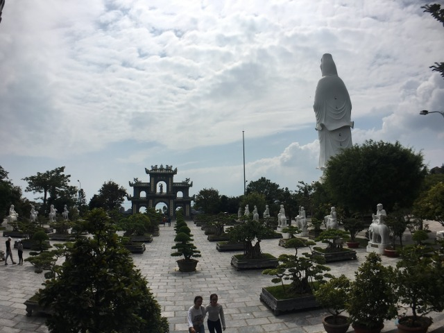

Da Nang befindet sich in der geographischen Mitte des Landes und ist aufgrund ihrer mit 20 Kilometern knapp bemessenen Entfernung zu der Unesco Stadt Hoi An fest mit dieser verbunden. 

Für jeden, der durch das Land reist sollten diese zwei Orte Pflichtprogramm sein. 

Die Stadt liegt nur knapp hinter dem Wolkenpass und ich freue mich sofort über den verhältnismäßig geregelten Verkehr, eine lange Strandpromenade und besonders über die Natur, von der die Stadt eingerahmt ist. 

Sandstrände zur Linken, Gebirge und Dschungel zur Rechten und wo in Rio de Janeiro die Christusstaute über die Stadt wacht übernimmt in Da Nang Lady Buddha diesen ehrwürdigen Part. 

Auch innerhalb des Glaubens möchte man die idealisierte Idee der Gender Equality schließlich nicht vergessen. 

Mit einer Million Einwohnern ist die Stadt die viert größte Vietnams und hat Locals und Expats gleichermaßen viel zu bieten. 

Wer Großstadt mag, aber auf das wilde Chaos Saigons verzichten kann und dies gerne gegen einen schönen Stadtstrand eintauscht ist hier genau richtig. 

Ich feiere in Da Nang die bereits zweite Reunion mit Paul und Fabian, die ich in Hai Phong kennengelernt und in Ninh Binh wiedergetroffen habe und gemeinsam machen wir uns auf, die Highlights der Küstenstadt zu erkunden. 

Nach drei intensiven Etappen auf meinem Roller inklusive Beinahe-Unfall, dank zerblasenem Reifen und Fast-Zwangsheirat auf der letzten Etappe genieße ich den ersten Tag nach meiner Ankunft am Stadtstrand und lasse gemeinsam mit meinen Bayernbuam die Seele baumeln. 

Ein feucht/fröhlicher Abend rundet einen gelungenen, ersten Tag ab und ich fühle mich nicht nur dank guter Gesellschaft direkt wohl in Da Nang. 

In den kommenden Tagen widmen wir uns dem Kultur- und Naturprogramm, das die Stadt zu bieten hat. 

Auf der Halbinsel Son Tra bestaunen wir die 67 Meter hohe Statue von Frau Buddha, sowie diverse andere Götzen uns bereits bekannter Gottheiten (Buddha ist genau genommen kein Gott, sondern ein Bewusstseinszustad, das würde an dieser Stelle aber zu weit führen...). 

_Glaub ma: In Da Nang hat FRAU Buddha das Sagen_

_Alle Tempelanlagen sind schön: Aber manche noch schöner!_

_Hat alles im Blick: Frau Buddha in ihrem Garten voller Bonsai Bäume_

Nach kulturellem Input und dem guten Gefühl dank Frau Buddha der Gleichberechtigung ausreichend Tribut gezollt zu haben fahren wir drei auf unseren abgerockten Mopeds weiter zu den Son Tra Mountains. 

Diese Berge sind nicht nur für tolle Natur und einen hervorragenden Blick über die Stadt bekannt, sondern auch für ihre Bewohner. Unzählige Affenarten haben sich dort niedergelassen und wer ein wenig Glück hat kann links und rechts der Wege jede Menge Affenaktion zu sehen bekommen. 

_Schau mal wer da schaut: Knuffiges Exemplar einer mir unbekannten Affenart_

Schnell lerne ich hier die Grenzen meines Rollers kennen. 

Anlauf und Muskelkraft wechseln sich nicht nur bei mir, sondern auch bei Fabian und Paul ab, um mit vereinten Kräften unsere müden Rösser gen Gipfel zu treiben. 

_Wer sich abmüht wird belohnt: Blick auf Da Nang_

Hart am Strand gechillt, schön Frau Buddha verehrt, nett Affen gesehen, weit ins Tal gegafft und ohne Motorschaden den ganzen Affenfelsen befahren. 

Gute Zeit hier! Sehr gute Zeit!

Am kommenden Morgen heißt es erneut Abschied nehmen, da die Bayernbuben sich aufmachen Hoi An zu erkunden. 

Ich erlaufe die Stadt in aller Ruhe und erfreue mich an sauberen, geordneten Straßen und besonders an den vielen beleuchteten Brücken, die das nächtliche Stadtbild eindrucksvoll prägen. 

Absolutes Highlight ist natürlich die Drachenbrücke. Ihr gegenüber niste ich mich des Abends ein und warte mit Spannung darauf, dass sie wie jedes Wochenende um 21:00 Uhr Feuer spuckt. 

Im Bereich Feuerspucken möchte ich rückwirkend eher von einem herausgehusteten Sodbrennen sprechen. Spektakulär ist anders. 
Das ständig wechselnde Farbenspiel der Brücke zu beobachten macht allerdings auch nach mehrfachem Durchlaufen der Farbyzklen einfach Spass und fesselt meinen Blick immer wieder. 

_Schwach im Bereich Feuerspucken, Stark im Bereich Farbenspiel: Das Wahrzeichen Da Nangs_

Da Nang hat vieles von dem zu bieten, was an asiatischen Großstädten reizt und lockt, ohne dabei allzu chaotisch und unübersichtlich zu sein. 

Nach vier Tagen in Da Nang ist für mich klar, dass ich meine Zelte hier aufschlagen werde, sofern mir Saigon als neue Wahlheimat nicht zusagen sollte. 

[Lies hier meinen Bericht zu Hoi An](http://abgefatzt.de/blog/hoi-an)

**Meine persönlichen Random Empfehlungen für Da Nang**

Unterkunft: Traveler Nest Hostel

Sehenswürdigkeiten: Stadtstrand, Dragon Bridge, Affenfelsen, Marmorberge, Lady Buddha

