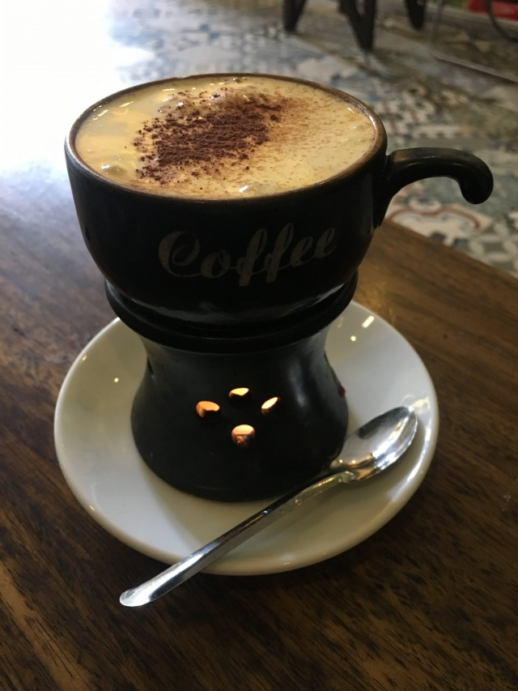
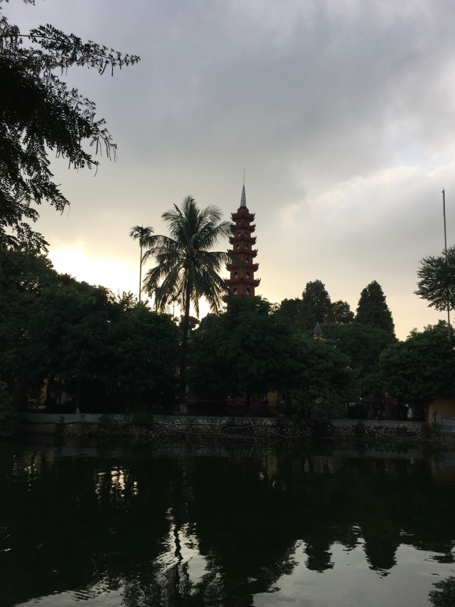

Ankunft in Hanoi 

Hanoi lässt mich sofort spüren, dass ich zurück in Asien bin. Drückend schwüle Luft treibt mir den Schweiss aus den Poren, das Atmen fällt in den ersten Minuten schwer. Ich kämpfe mich auf dem Weg zu meinem Hostel durch enge Gassen, husche durch den dicht gepackten Verkehr aus unzähligen Rollern und Streetfoodstände an allen Ecken locken mit betörenden Düften. Ich checke in mein Hostel ein, befreie mich von meinem Gepäck und tauche ein in das liebenswürdige Chaos namens Asien. 

_Chaos mit Charme: Zuggleise des „Hanoi Express" mitten durch die Wohnsiedlung_

Mein erster Weg führt mich ins Stadtzentrum, wo mich meine erste Pho Suppe auf kulinarischem Weg willkommen heißt. Ich schlendere ein paar mal um den See im Herzen Hanois, erfreue mich an nächtlichen Neonspektakeln ringsherum und kann ob der unzähligen Straßenverkäufern den nächsten Hunger kaum erwarten, um neue Köstlichkeiten auszuprobieren.  

Den Abend lasse ich bei ein paar Saigon Special am See ausklingen wo Einheimische mich direkt ins Gespräch verwickeln, um etwas über Deutschland zu lernen und ihr Englisch zu üben. 

_Brücke auf dem Hoan Kiem See im Stadtkern_

Müde und zufrieden falle ich am ersten Abend ins Bett. 

Zurück in Asien. 

Feels like home.

Die kommenden Tage lasse ich mich gemeinsam mit Freunden aus dem Hostel treiben, bewege mich überwiegend konzeptlos durch die Stadt und freue mich an allem, was ungewohnt ist oder in einer dampfenden Schüssel gereicht wird. 

Dank Foodbloggern wie Anthony Bourdain oder Erwan Heussaff bekommt mein Aufenthalt in Hanoi unerwartete Struktur und neue Ziele. 

Ich schlemme mich durch Escargot, Egg Coffee, Bun Cha, Banh Xeo, Banh Mi und Pho. 

_Ein absolutes Muss in Hanoi: Der Egg Coffe_

_Nicht Jedermanns Sache: Schnecken in Knoblauch_

Über mein Hostel werde ich nach ein paar Tagen an ein Mopedfachverkaufschgeschäft weitergeleitet. Dort finde ich schnell, wonach ich bereits in Deutschland gesucht hatte. Eine rote Yamaha Nouvo. 

Ein charmant abgeranztes Fortbewegungsmittel, dass auf Nord-Süd/Süd-Nord Trips bereits von unzähligen Backpackern gequält und zugeritten wurde. Zunächst läuft mein Charaktergefährt unter dem Arbeitstitel „Wanderhure”. 

Bei der Fahrzeugübergabe erhalte eine ausgiebige Einführung ins Thema Rollerfahren und Gepäck-Befestigung. 

Als ich zur Jungfernfahrt ansetze ist es bereits dunkel. Es beginnt zu regnen, der Feierabendverkehr quetscht sich hupend durch die Hauptstadt und ich bekomme einen ersten Eindruck, von dem was mich zu erwarten vermag. 

Kurz überlege ich umzudrehen und meinen Roller gegen eine Busfahrkarte zu tauschen, da hat mich der Verkehr bereits absorbiert. 
So lasse ich mich treiben und versuche mir meinen Weg zurück zu meinem Hostel zu kämpfen. Nach einer intensiven, ersten Fahrerfahrung freue ich mich zuhause über körperliche Unversertheit. Von einer „Mann/Maschine Einheit” sind rotes Moped und Fahrer zu diesem Zeitpunkt noch weit entfernt. 

Die letzten beiden Tage in Hanoi verwende ich dafür, aus der kühlen Distanz, die Roller und Fahrer noch wahren ein freundschaftliches Verhältnis erblühen zu lassen. 

Um den „West Lake” erkunde ich das Expat Viertel Hanois und erfreue mich daran, meine ersten Gehversuche auf meinem Roller abseits umtriebiger Innenstadtszenarien absolvieren zu können.

_Eines der Wahrzeichen Hanois: Tran Quoc Pagode_
 
Von Symbiose kann noch keine Rede sein, aber das Vertrauen wächst. 

Nach ein paar Tagen in Hanoi bin ich akklimatisiert und voller Tatendrang meine Reise gen Süden anzutreten. 

Am sechsten Tag mache ich mich auf, meine erste Tagesetappe zu bestreiten. 

Ich versuche meine beiden Rucksäcke, die zerflädderten Gummibänder, die es zum Fahrzeug dazu gab und meinen Roller zu einer Einheit verschmelzen zu lassen, die auch durch die tiefsten Schlaglöcher nicht getrennt werden kann. Mein deutscher Ordnungssinn rät zu äußerster Sorgfalt und diversen Nachbesserungsarbeiten. 

Kaum 40 Minuten später sind Gepäck und Wanderhure unzertrennbar und ich durchgeölt bis auf die Unterhose und reif für eine zweite Morgendusche. 

_Bereit für die erste Tagesetappe: Moped und Gepäck vereint_

Am Strassenrand sitzt eine alte Dame und beobachtet das verzweifelte Spektakel. Vermutlich könnte sie in einem Bruchteil der Zeit mit einem Bindfaden eine Gefrierkombination auf einem Fahrrad befestigen. 
Kurz frage ich mich, wer sich an dieser Stelle mehr über mich wundert. 

Sie oder ich selbst?! 

Mit pantherhafter Geschmeidigkeit schwinge ich mich auf mein rotes Moped, lächle der alten Dame freundlich zu und trete meine Reise an. 

Nächster Halt: Hai Phong 

[Lies hier weiter](http://abgefatzt.de/blog/hai-phong)

**Meine persönlichen Random Empfehlungen für Hanoi**

Unterkunft: Luxury Backpacker

Sehenswürdigkeiten: Old Town, Stadtzenrum, West Lake, Hanoi Train Street

Essen/Trinken: Egg Coffee, Escargot, Pho, Banh Mi, Banh Xeo, Bun Rieu

**Tolle Youtubevideos rund ums Thema Streetfood in Hanoi**

[**Erwan Heussaff**](https://www.youtube.com/watch?v=e8Ge4MtsLXA&t=143s)„What to do in Hanoi – Overnight City Guide”

[**Mark Wiens**](https://www.youtube.com/watch?v=T0gwaAP5k9Y)„FIVE Must-Eat Hanoi STREET FOODS”

