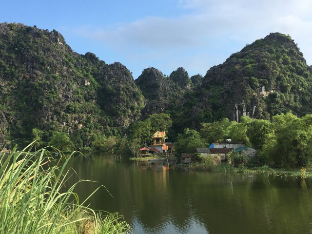
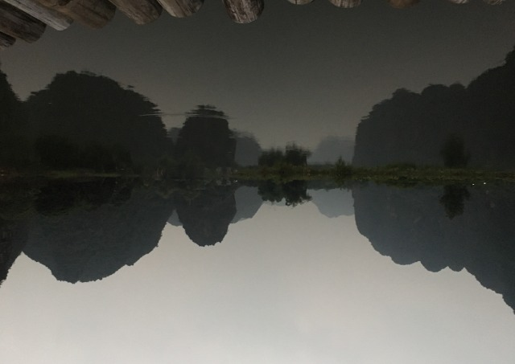
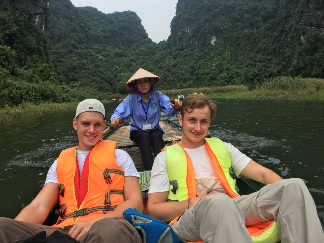
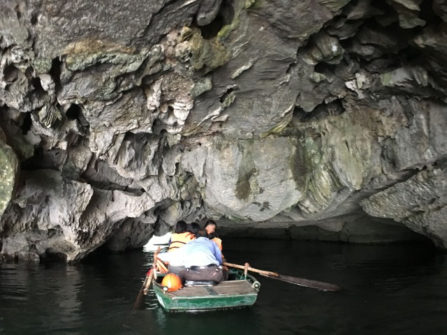
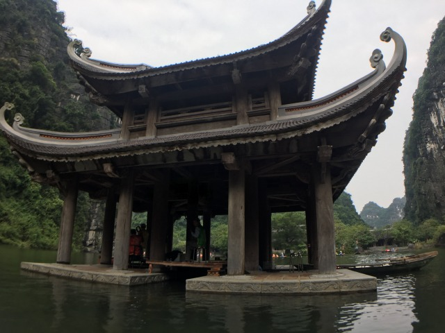
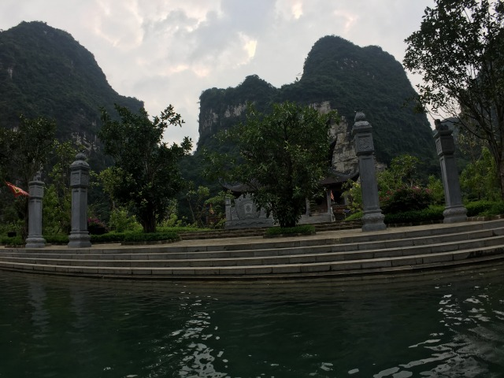
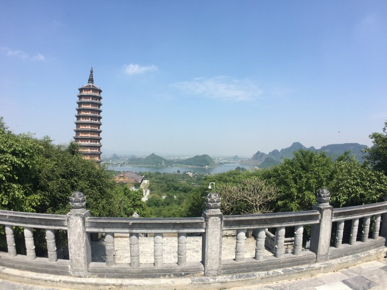
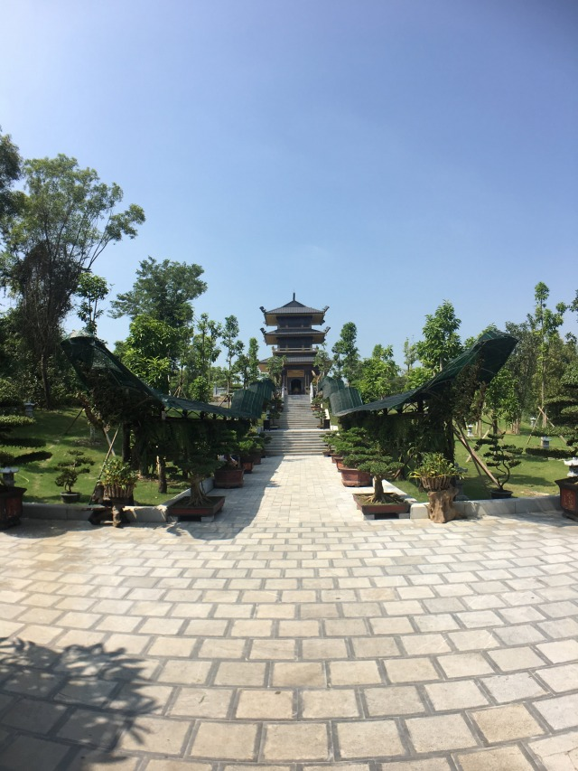
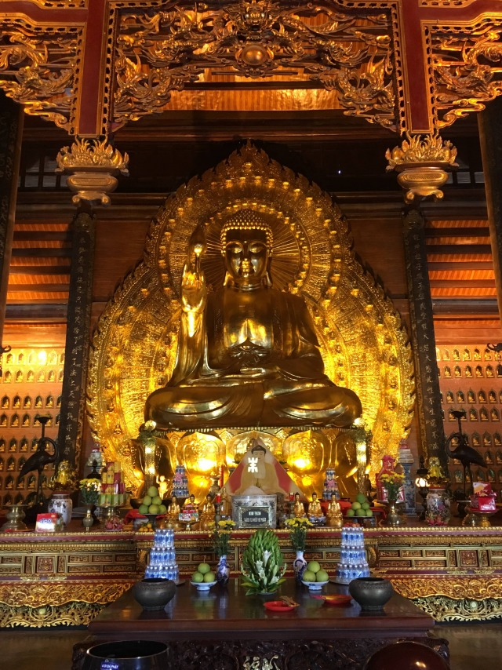
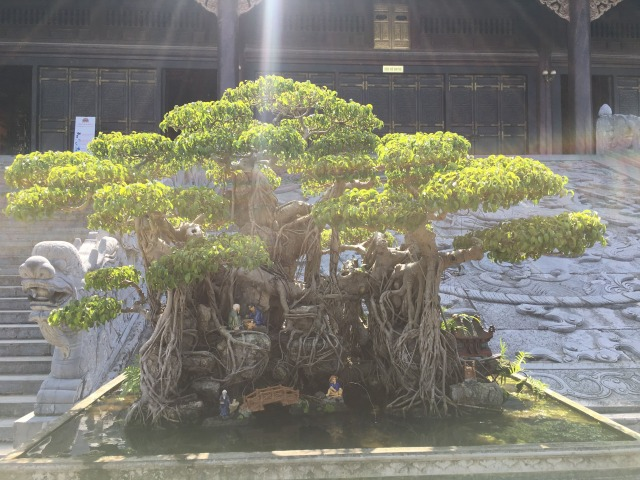

Zweite Tagesetappe von Hai Phong nach Ninh Binh. 

Das Naturparadies Zentralvietnams. 

Die Gegend um Ninh Binh wird häufig auch „Trockene Halong Bay” genannt. Sobald man sich etwas aus der Stadt heraus bewegt wird auch schnell klar, wie die Stadt zu ihrem ehrwürdigen Titel kommt. 

So weit das Auge reicht durchziehen Karstfelsen, Flüsse, Berge, tropische Wälder und Höhlen die Gegend ringsum die mit knapp 170.000 Einwohnern überschaubar große Stadt. 

Nach drei Stunden und 130 Kilometern erreiche ich Ninh Binh. Auch diese Tagesetappe -obschon angenehmer als die erste Tagesstour- war für Mensch und Maschine kein Genuss. Auch nach der zweiten Tagesfahrt fühlt sich mein Körper an, wie mit zigtausenden Ameisen bedeckt. Alles kribbelt, kitzelt und zwickt. 

Mein Hostel ist irgendwo im Nirgendwo, direkt am Fuße eines beeindruckenden Karstfelsens eingebettet in einer der spektakulärsten Landschaften Vietnams. 

Nach der Busfahrt nicht weniger verorgelt als ich nach der Rollertour begrüße ich am Abend Fabian und Paul aus Hai Phong und freue mich darüber die Gegend rund um Ninh Binh gemeinsam mit ihnen erkunden zu können. 

In den kommenden Tagen entdecken wir die Gegend rund um die trockene Halong Bucht zu Fuß, per Roller oder zu Wasser auf einem der vielen Boote, die Besucher auf den Flussstraßen um Ninh Binh ins Staunen versetzen. 

Nicht nur die Natur weiß hier zu begeistern, auch der größte buddhistische Tempel Vietnams ist in NInh Binh zu finden. 

Ausser gaffen kann man wenig machen in Ninh Binh. 

Das aber auf Weltklasseniveau. 

Sowohl Natur, als auch Tempel sind absolut sehenswert und für mich zurecht Spitzenreiter meiner Vietnam Highlights. 

Da Bilder bekanntlich mehr als 1000 Worte sagen soll dieser Blogeintrag im Folgenden überwiegend vom Bildmaterial leben. 

_Könnte schlimmer sein: Ausblick von der Hostelterrasse_

_Upside down: Spiegelung der Karstfelsen in einem See_

_Vorne gaffen die Touris, hinten kurbelt die Uschi: Bootsausflug auf einem der unzähligen Flüsse um Ninh Binh_

_Kopf einziehen: Unter den Felsen geht es eng her, wer klaustrophobisch veranlagt ist schaut sich besser nach einer Alternativaktivität_

_Irgendwo ist immer ein Buddha: Tempelinsel inmitten der Karstfelsen-/Flusslandschaft_

_Ein Tempel kommt selten allein: Traumhafte Klosteranlage auf einer Flussinsel eingerahmt von atemberaubenden Felsformationen_

_So weit das Auge reicht: Ausblick vom höchsten Punkt der Tempelanlage Bai Dinh
_

_Viel Grün und schöne Gebäude: Bai Dinh, größte Tempelanlage Vietnams_

_Wer ist hier der Boss: Natürlich der riesengroßer Buddha, den ich lt. Schild eigentlich gar nicht hätte fotografieren dürfen O,o _

_Selten so ein Prachtexemplar gesehen: Bonsaibaum in der Tempelanlage Bai Dinh _

Wer Natur mag und sich gerne abseits turbulenter Großstadszenarien wiederfindet ist in Ninh Binh bestens aufgehoben. Diverse Reiseunternehmen in und um Hanoi bieten ein- oder mehrtägige Tagestouren an, um das Naturparadies erleben zu können. 

Nächster Halt: Vinh

[Lies hier weiter](http://abgefatzt.de/blog/vinh-und-dong-hoi)

**Meine random Empfehlungen für Ninh Binh**

Unterkunft: Trang An Mountain House

Sehenswürdigkeiten/Aktivitäten: Roller- /Radfahrt rund um Ninh Binh und Tam Coc, Bootsfahrt auf dem Fluss, Tempelanlage Bai Dinh 

Essen und Trinken: Ziegenfleisch 