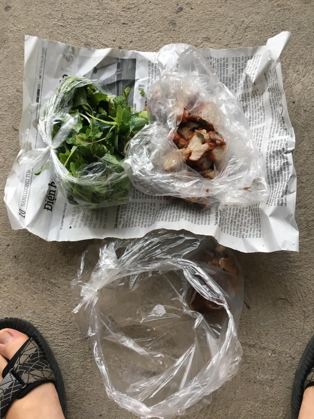
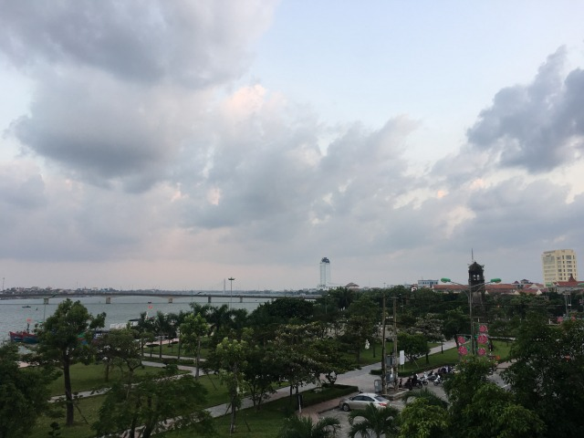
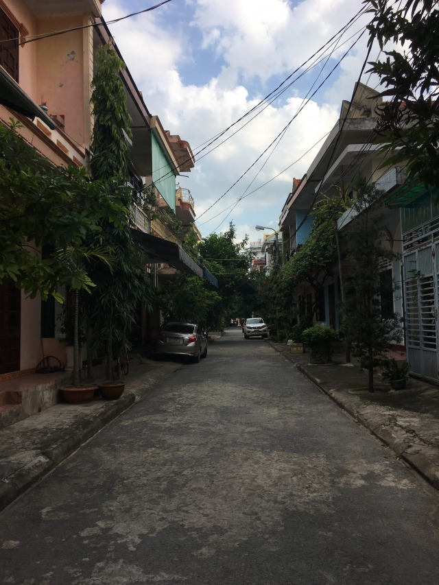
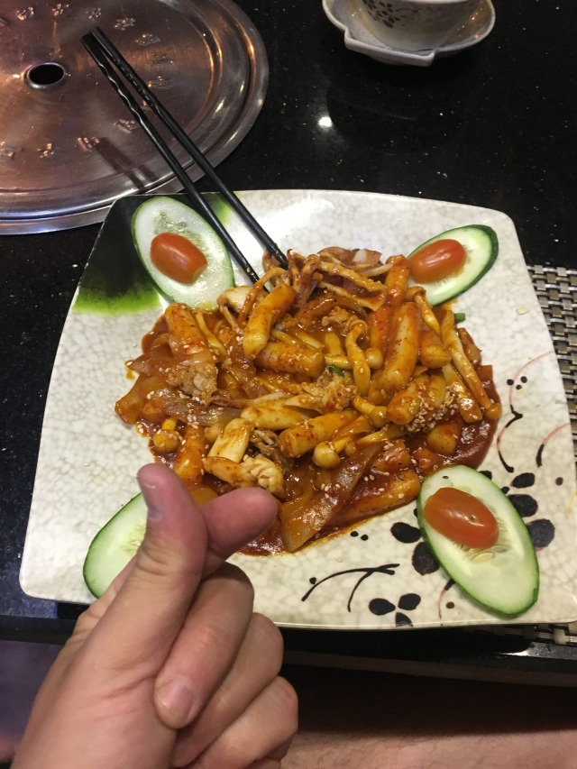

Dritte und vierte Tagesetappe von Ninh Binh über Vinh nach Dong Hoi.

Nach einer ausgiebigen Portion Natur und Ruhe in Ninh Binh mache ich mich nach fünf Tagen auf, mich wieder ins Stadtleben zu stürzen. 

Leider ist mein nächstes Wunschziel Hue stolze 570 Kilometer südlich von mir und so erwarten mich die ersten Tagesetappen über 200 Kilometer. 

Zwischen Ninh Binh und Hue gibt es für mich (und vermutlich für die meisten anderen Reisenden ebenfalls) nicht viel zu sehen/erleben und so beschließe ich in Vinh und Dong Hoi nur kurze Zwischenstopps einzulegen. 

Aufstehen – Fahren – Schlafen - Repeat

Da meine gewählte Küstenroute mich nicht durchs Landesinnere führt streife ich den Nakai-Nam Theun Nationalpark nur leicht, nach den Eindrücken aus Ninh Binh vermag es so schnell ohnehin keine Naturszenerie mich ins Staunen zu versetzen.

Ab Vinh werden meine Tagesetappen abwechslungsreicher und besonders landschaftlich wesentlich schöner. 

Eine gute Mischung aus ruhigen Landstraßen und hektischen Schnellstraßen, sowie unscheinbaren Dörfern, die ich alle paar Kilometer durchquere bereiten mir zwei abwechslungsreiche Fahrtage. 

Mensch und Moped sind nach diesen ersten Mammutetappen gut befreundet und auch das allmorgendliche Aufsatteln geht zunehmend einfacher von der Hand. 

Irgendwo im Nirgendwo zwischen Ninh Binh und Vinh meldet sich mein Magen, beim durchqueren eines kleinen Dorfes stolpert mein suchendes Auge über ein paar Streetfoodstände. 

Schwerpunkt der Talentlage des Dorfes scheint die Zubereitung von Bratenten zu sein und so genieße ich eine hervorragende Mahlzeit, aus krosser Ente, Erdnusssauce und Kräutern. 

_Ente gut alles gut: Zwischenmahlzeit auf dem Weg von Ninh Binh nach Vinh_

Frisch gestärkt beende ich meine erste lange Tagesfahrt bei einsetzender Dunkelheit und merke schnell, dass 200 Kilometer auf dem Roller in Vietnam sich nach 800 Kilometern in einem Kleinwagen in Deutschland anfühlen. 

Geknechtet aber glückllich falle ich in Vinh in das erste Hotelbett dieser Reise, raffe mich zu später Stunde noch mal auf, um auf der Straße Banh Xeo (vietnamesischer Pfannkuchen) als spätes Abendessen einzubauen, sodass ich am nächsten Morgen frisch gestärkt meine nächste Etappe antreten kann. 

Die Strecke von Vinh nach Dong Hoi ist mit über 200 Kilometern kein Katzensprung, ich kann die Fahrt aber dank angenehmer Landschaften genießen und entdecke mit Dong Hoi eine Stadt, die zwar wenig aufregend ist, sich aber durchaus sehen lassen kann. 

_Beschaulich aber schön: Promenade in Dong Hoi _

_Muckelig mit einer Prise Frankreich: Nettes Gässchen in Dong Hoi_

Da ich noch bei Helligkeit die Stadt erreiche habe ich in Dong Hoi die Chance mich etwas umzusehen und mir ein Bild von der Stadt zu machen. 
Ziellos schlendere ich etwas umher, erkunde die Promenade und kann auf einer Bank am Meer etwas die Seele baumeln lassen. Durch Zufall entdecke ich ein koreanisches Restaurant und genieße Tteokbokki (dicke Reisnudeln) zum Abendessen. 

_Meine große Liebe seit einem Auslandssemester in 2015: Koreanisches Essen_

Nächster Halt: Hue/Da Nang

[Lies hier weiter](http://abgefatzt.de/blog/auf-dem-motorrad-durch-vietnam-4-etappe-ueber-den-wolkenpass-nach-da-nang)

**Meine persönlichen random Empfehlungen für Vinh und Dong Hoi**

Sehenswürdigkeiten: Nakai-Nam Theun Nationalpark, Hong Son Tempel in Vinh, Promenade von Dong Hoi, Nhat-Le Fluss in Dong Hoi

Essen/Trinken: Wegente 

